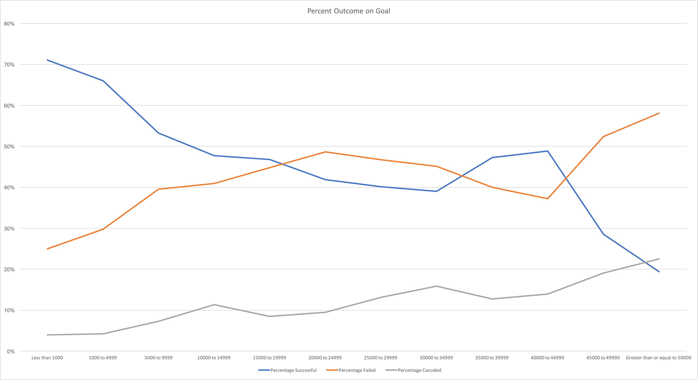

# Kickstart My Chart

The goal of Kickstart My Chart is to analyze market trends of 4,000 past Kickstarter projects with Excel.
Identify the top three categories, subcategories and percent outcome based on the goal.

### Analysis
Use conditional formatting to distinguish successful, failed, canceled, or live.

Convert timestamps to a MM-DD-YY format.

Calculate the percent funded and average donation. 

Concatenate and parse columns as needed to analyze subcategories separately from categories.

Create pivot table and line graph to view the status of campaigns by sub-category.

Create pivot table and line graph to view the status of campaigns by category and include filter for years.

Using COUNTIFS(), calculate the percentage of projects that were successful, failed, or canceled per goal range. Plot a line graph.

### Conclusions
The top three successful outcomes _by category_ are as follows: **theater, music, film & video.**

The top three successful _sub-categories_ are as follows: **plays, rock, documentary.**

The most successful projects are launched in the spring, leading to saturation by the summer. Conversely, holidays are the least successful time of year. A second wind is observed in October, this is consistent with the turn of the fiscal year but yet to be demonstrated as causation.

**As the goal increases, the outcome for success declines.**

### Data Limitations

* Sector/Field is not captured. Public crowd-sourcing is increasing as government budgets are re-allocated, reduced or cut.

* Views per project are not captured. It may be useful to understand the number of views vs. the number of backers. (i.e., Is the project failing to engage backers or not obtaining as many views to begin with?)

* Currently, the origin or currency of backers is not captured. Is there a correlation between country where the project launched in vs the currency of backers?

* Mode or frequency of a donation amount is not captured. It may be helpful to assess mode donation amount by country. (i.e., if backers in other countries spend more money, this finding could prompt to drive more engagement in the region.)

* Suggested donation amount by default (if applicable) is not captured. (i.e., Do backers abide by the suggested donation amount or behave independently?)
* Video presence is not captured. (i.e., Do projects with videos to tell the story or background encourage backers to donate than projects without videos?)

### Recommendations for Next Steps
* Determine if there is a correlation between a staff pick and [Percent Funded, backers, or Successful Outcome]. (Line graph)
* Assess trends between staff pick and category. (Bar graph)
* Assess the successful categories by country to understand what areas various countries prefer to invest in. (Bar graph)
* Sort by descending number of projects, determine which countries have the most to least launches to assess engagement. (Bar graph)
* Determine the average donation per category by country. (Bar graph)
